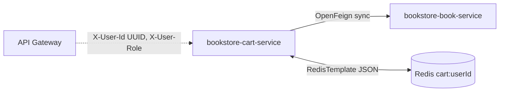

# Chi tiết dependency — `bookstore-cart-service`

Tài liệu này mô tả **các dependency đồng bộ / hạ tầng** mà `bookstore-cart-service` phụ thuộc khi chạy, đặc biệt là **contract HTTP** mà service gọi qua **OpenFeign** để **validate sách / lấy giá / tồn kho** (tương đương logic monolithic gọi `BookRepository`).

Nguồn đối chiếu trong repo:

- Cart-service: [BookServiceClient.java](src/main/java/com/notfound/cartservice/client/BookServiceClient.java), [CartServiceImpl.java](src/main/java/com/notfound/cartservice/service/impl/CartServiceImpl.java), [FeignConfig.java](src/main/java/com/notfound/cartservice/config/FeignConfig.java)
- Monolithic (tham khảo luồng giỏ hàng): [monolithic/DHKTPM18B_NotFound_WebSiteBanSach-deploy/src/main/java/com/notfound/bookstore/service/impl/CartServiceImpl.java](../../monolithic/DHKTPM18B_NotFound_WebSiteBanSach-deploy/src/main/java/com/notfound/bookstore/service/impl/CartServiceImpl.java)
- Kiến trúc / ADR: [ai-agent/context/architecture.md](../../ai-agent/context/architecture.md), [ai-agent/context/api.md](../../ai-agent/context/api.md)

> **Lưu ý về path**: Public cart-service expose **`/api/v1/cart/**`**. Feign gọi book-service tại **`GET /api/v1/books/{id}`** — cần khớp controller + gateway của `bookstore-book-service`.

---

## 0) Tổng quan luồng phụ thuộc



| Dependency | Loại | Mục đích trong cart-service |
| --- | --- | --- |
| **book-service** | OpenFeign (HTTP sync) | Lấy thông tin sách khi `addItem` / `updateItem` / `snapshot` (giá, title, cover, stock) |
| **Redis** | Datastore (TCP, không phải REST contract ở đây) | Lưu giỏ `cart:{userId}` dạng JSON, TTL 7 ngày |
| **RabbitMQ** | Có trong `pom.xml` | **Chưa dùng** trong scope hiện tại (không publish/consume) |

---

## 1) Book Service (`bookstore-book-service`) — Bắt buộc cho validate giỏ

### 1.1 `GET /api/v1/books/{id}`

- **Mục đích**: Cart-service gọi Feign trong `fetchBook(UUID bookId)` để:
  - Kiểm tra sách tồn tại
  - Lấy `title`, `price`, `coverUrl`, `stock` để gắn vào `CartItem` và kiểm tra tồn kho (`BookOutOfStockException` nếu `stock < quantity`)

#### Request (Feign)

- **Method**: `GET`
- **Path params**
  - `id`: `UUID` — định danh sách trong book-service (phải khớp kiểu UUID với cart/monolith)

Ví dụ:

```http
GET /api/v1/books/b7c7f8b0-1a2b-3c4d-5e6f-1234567890ab
Host: book-service:8080
```

Cấu hình base URL (cart-service):

| Môi trường | Biến | Giá trị mặc định gợi ý |
| --- | --- | --- |
| Local | `BOOK_SERVICE_URL` / `book-service.url` | `http://localhost:8082` |
| Docker / K8s | `BOOK_SERVICE_URL` | `http://book-service:8080` |

#### Response — wrapper `ApiResponse` (cart-service parse `result` hoặc alias `data`)

Cart-service deserialize vào [BookApiResponse](src/main/java/com/notfound/cartservice/client/dto/BookApiResponse.java) → field `result` kiểu [BookResponse](src/main/java/com/notfound/cartservice/client/dto/BookResponse.java).

**200 OK** — JSON khuyến nghị (khớp `BookResponse` + alias):

```json
{
  "code": 200,
  "message": "Success",
  "result": {
    "id": "b7c7f8b0-1a2b-3c4d-5e6f-1234567890ab",
    "title": "Clean Code",
    "price": 120000,
    "originalPrice": 150000,
    "stock": 42,
    "coverUrl": "https://cdn.example.com/books/clean-code.jpg",
    "active": true
  }
}
```

Các field **cart-service đang đọc** (có `@JsonAlias` để linh hoạt tên JSON):

| Field logic | Kiểu | Alias JSON được chấp nhận |
| --- | --- | --- |
| `id` | UUID | — |
| `title` | string | — |
| `price` | number (BigDecimal) | — |
| `originalPrice` | number \| null | `original_price` |
| `stock` | integer \| null | `stockQuantity`, `stock_quantity` |
| `coverUrl` | string \| null | `cover_url`, `imageUrl` |
| `active` | boolean \| null | — |

**Quy ước khi `price` null**: cart-service gán `BigDecimal.ZERO` trước khi tính subtotal.

#### Lỗi & mapping sang cart-service

| HTTP book-service | Hành vi cart-service (tóm tắt) |
| --- | --- |
| **404** | `ResourceNotFoundException` → HTTP **404** (sách không tồn tại) |
| **5xx / 503** hoặc timeout | `ServiceUnavailableException` → HTTP **503** (`book-service` không khả dụng) |
| Timeout | `Request.Options`: connect **3s**, read **5s** ([FeignConfig.java](src/main/java/com/notfound/cartservice/config/FeignConfig.java)) |

Ngoài ra, `CartServiceImpl` bắt `FeignException.NotFound` riêng để map 404 → `ResourceNotFoundException("Book", bookId)`.

---

## 2) Redis — Lưu trữ giỏ (không phải REST dependency)

- **Key**: `cart:{userId}` với `userId` là **UUID string** (ví dụ `cart:11111111-1111-1111-1111-111111111111`).
- **Value**: JSON object `Cart` (Jackson), gồm `userId`, `items[]`, `updatedAt`, …
- **TTL**: 7 ngày (refresh khi thao tác giỏ).

Contract này là **nội bộ cart-service**, không phải API công khai cho service khác.

---

## 3) API Gateway — Header tin cậy (ADR-006)

Public REST cart-service: **`/api/v1/cart/**`** (cùng prefix với route gateway).

Cart-service **không** validate JWT; tin cậy header do gateway forward:

| Header | Kiểu | Bắt buộc | Ghi chú |
| --- | --- | --- | --- |
| `X-User-Id` | UUID string | Có (cho mọi endpoint giỏ) | Parse `UUID.fromString`; sai format → **401** |
| `X-User-Role` | string | Khuyến nghị | Mặc định logic có thể coi `ROLE_USER` nếu thiếu |

Đây không phải “gọi HTTP sang gateway”, nhưng là **contract tích hợp** bắt buộc khi deploy sau gateway.

---

## Notes khi maintain Feign ở cart-service

- Giữ **timeout** hợp lý: book-service chậm không nên treo thread cart quá lâu (đã cấu hình 3s/5s).
- Nếu book-service đổi shape JSON: cập nhật `BookResponse` / `@JsonAlias` hoặc thống nhất schema `ApiResponse` với các service khác.
- Khi nâng version API (v2…): cập nhật `@GetMapping` trong `BookServiceClient` và `@RequestMapping` trên `CartController` đồng bộ với gateway.
